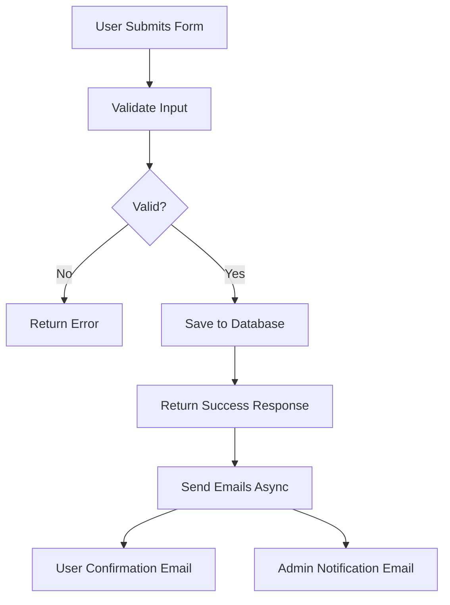
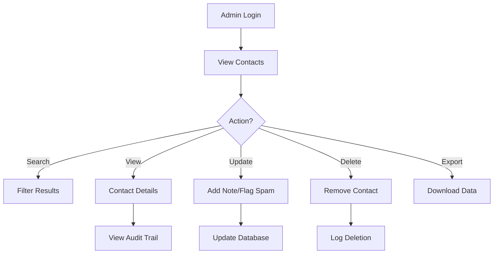

# Contact Us Management System

## Overview

The Contact Us Management System provides a comprehensive solution for handling contact form submissions from users. It includes form validation, email notifications, admin management features, and detailed tracking capabilities.

## File Structure

```
server/
├── src/
│   ├── models/
│   │   └── contact-us/
│   │       └── contact.js              # Contact data model with schema definition
│   ├── routes/
│   │   └── contact-us/
│   │       └── contact.js              # API routes for contact management
│   ├── controllers/
│   │   └── contact-us/
│   │       └── contactController.js    # Request handlers for all contact endpoints
│   ├── services/
│   │   └── contact-us/
│   │       ├── contactService.js       # Business logic for contact operations
│   │       └── contactEmailService.js  # Email service for contact notifications
│   ├── mails/
│   │   └── contactEmailTemplate.js     # Email templates for user/admin notifications
│   └── utils/
│       └── sendContactEmail.js         # Email utility specific to contact emails
└── docs/
    └── contact-us-management.md        # This documentation file
```

## Features

### Public Features
- Contact form submission with validation
- Automatic email confirmation to users
- Category-based inquiries (Services, Feedback, Analyst Relations)
- Technical information collection (IP, browser, location)

### Admin Features
- View and manage all contact submissions
- Search and filter contacts
- Add notes and flag spam
- Export contact data
- Bulk operations
- Audit trail tracking

## API Endpoints

### Public Endpoints

#### Create Contact
```
POST /api/contact-us/contacts
```

**Request Body:**
```json
{
  "name": "John Doe",
  "email": "john@example.com",
  "message": "Your message here",
  "category": {
    "id": "services"  // services | feedback | analyst
  },
  "technicalInfo": {
    "ip": {
      "ipv4": "192.168.1.1",
      "ipv6": "2001:0db8:85a3:0000:0000:8a2e:0370:7334"
    },
    "location": {
      "country": "India",
      "countryCode": "IN",
      "city": "Bhopal",
      "region": "Madhya Pradesh",
      "state": "Madhya Pradesh",
      "postal": "462001",
      "zipCode": "462001",
      "latitude": 23.2599,
      "longitude": 77.4126,
      "timezone": "Asia/Kolkata"
    },
    "network": {
      "isp": "Bharti Airtel Ltd",
      "organization": "Airtel Broadband",
      "asn": "AS9498",
      "domain": "airtelbroadband.in"
    },
    "browser": {
      "name": "Chrome",
      "version": "119.0.0.0"
    },
    "device": {
      "type": "mobile",
      "model": "iPhone 14 Pro",
      "vendor": "Apple",
      "os": {
        "name": "iOS",
        "version": "17.1.0"
      },
      "screen": {
        "width": 393,
        "height": 852,
        "pixelRatio": 3
      }
    }
  }
}
```

**Response:**
```json
{
  "message": "Thank you for contacting us. We will get back to you soon.",
  "status": "success",
  "contactId": "65f8a9b8c9e7f1234567890a"
}
```

### Admin Endpoints (Authentication Required)

#### Get Contacts (Paginated)
```
GET /api/contact-us/contacts/paginated?page=1&perPage=10&sortField=createdAt&sortOrder=desc
```

#### Get Contact Details
```
GET /api/contact-us/contacts/:id
```

#### Search Contacts
```
GET /api/contact-us/contacts/search?searchText=john&page=1&perPage=10
```

#### Filter Contacts
```
GET /api/contact-us/contacts/filter?country=India&category=services&dateFrom=2024-01-01&dateTo=2024-12-31
```

#### Get Statistics
```
GET /api/contact-us/contacts/statistics?dateFrom=2024-01-01&dateTo=2024-12-31
```

#### Export Contacts
```
GET /api/contact-us/contacts/export?dateFrom=2024-01-01&dateTo=2024-12-31
```

#### Delete Contact
```
DELETE /api/contact-us/contacts/:id
```

#### Update Contact
```
PUT /api/contact-us/contacts/:id
```

#### Add Note
```
POST /api/contact-us/contacts/:id/notes
```

**Request Body:**
```json
{
  "content": "Follow-up completed. Issue resolved."
}
```

#### Update Note
```
PUT /api/contact-us/contacts/:id/notes/:noteId
```

#### Flag as Spam
```
PUT /api/contact-us/contacts/:id/flag-spam
```

**Request Body:**
```json
{
  "notes": "Promotional content, not genuine inquiry"
}
```

#### Bulk Delete
```
POST /api/contact-us/contacts/bulk-delete
```

**Request Body:**
```json
{
  "contactIds": ["id1", "id2", "id3"]
}
```

#### Get Audit Trail
```
GET /api/contact-us/contacts/:id/audit-trail
```

## Data Model

### Contact Schema
**File:** `server/src/models/contact-us/contact.js`

```javascript
{
  name: String (required),
  email: String (required),
  message: Object,
  category: {
    id: String (enum: ['services', 'feedback', 'analyst']),
    name: String
  },
  technicalInfo: {
    ip: {
      ipv4: String,
      ipv6: String
    },
    location: {
      country: String,
      countryCode: String,
      city: String,
      region: String,
      postal: String,
      coordinates: {
        latitude: Number,
        longitude: Number
      },
      timezone: String
    },
    network: {
      isp: String,
      organization: String,
      asn: String,
      domain: String
    },
    browser: {
      userAgent: String,
      language: String,
      name: String,
      version: String
    },
    device: {
      type: String, // mobile, tablet, desktop, laptop
      model: String,
      vendor: String,
      os: {
        name: String,
        version: String
      },
      screen: {
        width: Number,
        height: Number,
        pixelRatio: Number
      }
    },
    metadata: {
      collectedAt: Date
    }
  },
  isSpam: Boolean,
  spamInfo: {
    notes: String,
    flaggedBy: ObjectId,
    flaggedAt: Date
  },
  notes: [{
    content: String,
    addedBy: ObjectId,
    addedAt: Date,
    lastEdited: Date,
    editHistory: [{
      previousContent: String,
      editedBy: ObjectId,
      editedAt: Date
    }]
  }],
  lastUpdatedBy: ObjectId,
  lastUpdatedAt: Date,
  timestamps: true
}
```

## Email Templates
**File:** `server/src/mails/contactEmailTemplate.js`

### User Confirmation Email
- Sent immediately after form submission
- Contains submission details and reference ID
- Professional design with Ministry branding
- Includes contact information for follow-up

### Admin Notification Email
- Sent to configured admin emails
- Contains full submission details
- Priority flagging based on category
- Direct link to admin panel

## Workflow

### Contact Submission Flow



### Admin Management Flow



## Configuration

### Required Files Summary

1. **Model Layer**
   - `server/src/models/contact-us/contact.js` - MongoDB schema definition

2. **Route Layer**
   - `server/src/routes/contact-us/contact.js` - Express route definitions

3. **Controller Layer**
   - `server/src/controllers/contact-us/contactController.js` - Request/Response handlers

4. **Service Layer**
   - `server/src/services/contact-us/contactService.js` - Business logic
   - `server/src/services/contact-us/contactEmailService.js` - Email operations

5. **Email Templates**
   - `server/src/mails/contactEmailTemplate.js` - HTML email templates

6. **Utilities**
   - `server/src/utils/sendContactEmail.js` - Email sending utility

### Environment Variables

```env
# Email Configuration (uses existing)
ZOHO_NODEMAILER_EMAIL_HELLO=hello@yourdomain.com
ZOHO_NODEMAILER_PASSWORD_HELLO=your_password

# Admin Emails (optional)
CONTACT_ADMIN_EMAILS=admin1@domain.com,admin2@domain.com
```

If `CONTACT_ADMIN_EMAILS` is not set, defaults to:
- admin@shivrajsinghchouhan.co.in
- info@shivrajsinghchouhan.co.in

## Geolocation Services

### Recommended Free APIs for Frontend

1. **ipapi.co** (Used in example)
   - Free tier: 1,000 requests/month
   - No API key required for basic usage
   - Returns IP, location, ISP info

2. **ipgeolocation.io**
   - Free tier: 1,000 requests/month
   - Requires API key
   - More detailed ISP information

3. **ip-api.com**
   - Free tier: 45 requests/minute
   - No API key required
   - Good for development

### Frontend Implementation Example

```javascript
// Using multiple services for redundancy with device detection
const getCompleteLocationInfo = async () => {
  const technicalInfo = {
    ip: {},
    location: {},
    network: {},
    browser: {},
    device: {}
  };

  try {
    // Try primary service
    const response = await fetch('https://ipapi.co/json/');
    const data = await response.json();
    
    technicalInfo.ip = {
      ipv4: data.ip,
      ipv6: data.version === 'IPv6' ? data.ip : null
    };
    
    technicalInfo.location = {
      country: data.country_name,
      countryCode: data.country_code,
      city: data.city,
      region: data.region,
      state: data.region,
      postal: data.postal,
      latitude: data.latitude,
      longitude: data.longitude,
      timezone: data.timezone
    };
    
    technicalInfo.network = {
      isp: data.org,
      organization: data.org,
      asn: data.asn,
      domain: window.location.hostname
    };
  } catch (error) {
    console.error('Primary geolocation service failed:', error);
  }

  // Get device and browser information
  const deviceInfo = getDeviceInfo();
  const { browser } = parseUserAgent(navigator.userAgent);
  
  technicalInfo.browser = browser;
  technicalInfo.device = deviceInfo;

  // Get accurate coordinates if user permits
  if (navigator.geolocation) {
    try {
      const position = await new Promise((resolve, reject) => {
        navigator.geolocation.getCurrentPosition(resolve, reject, {
          timeout: 5000,
          enableHighAccuracy: true
        });
      });
      
      technicalInfo.location.latitude = position.coords.latitude;
      technicalInfo.location.longitude = position.coords.longitude;
    } catch (error) {
      console.log('User denied location access or timeout');
    }
  }

  return technicalInfo;
};
```

## Security Features

1. **Input Validation**
   - Email format validation
   - Required field checks
   - Category validation
   - XSS prevention

2. **Authentication**
   - Admin endpoints require authentication
   - Super admin access for management features

3. **Rate Limiting**
   - Applied to public submission endpoint
   - Prevents spam and abuse

4. **Audit Trail**
   - Tracks all contact modifications
   - Logs deletions and updates
   - Maintains edit history for notes

## Best Practices

### For Users
1. Provide accurate contact information
2. Select appropriate category for faster response
3. Be specific in your message
4. Check spam folder for confirmation email

### For Administrators
1. Review new contacts daily
2. Add notes for follow-up actions
3. Flag spam to maintain data quality
4. Use filters for efficient management
5. Export data regularly for backup

## Error Handling

### Common Errors

1. **400 Bad Request**
   - Missing required fields
   - Invalid email format
   - Invalid category

2. **404 Not Found**
   - Contact ID doesn't exist
   - Note ID doesn't exist

3. **500 Internal Server Error**
   - Database connection issues
   - Email service failures

### Error Response Format
```json
{
  "message": "Error description",
  "status": "error",
  "errors": ["Detailed error messages"] // Optional
}
```

## Performance Considerations

1. **Asynchronous Email Sending**
   - Emails sent after response to user
   - Prevents delays in form submission

2. **Database Indexes**
   - Email field indexed for fast lookup
   - CreatedAt indexed for sorting
   - Category indexed for filtering

3. **Pagination**
   - Default 10 items per page
   - Configurable via query params

4. **Transaction Support**
   - Create and update operations use transactions
   - Ensures data consistency

## Integration Guide

### Route Registration
**File:** `server/app.js` or main server file

```javascript
// Import contact routes
const contactRoutes = require('@routes/contact-us/contact');

// Register routes
app.use('/api/contact-us', contactRoutes);
```

### Frontend Integration

```javascript
// Function to detect device type based on user agent and screen size
const detectDeviceType = (userAgent, screenWidth) => {
  const isMobile = /Android|webOS|iPhone|iPad|iPod|BlackBerry|IEMobile|Opera Mini/i.test(userAgent);
  const isTablet = /iPad|Android(?!.*Mobile)/i.test(userAgent) || (screenWidth >= 768 && screenWidth <= 1024);
  
  if (isMobile && !isTablet) return 'mobile';
  if (isTablet) return 'tablet';
  return screenWidth >= 1024 ? 'desktop' : 'laptop';
};

// Function to parse user agent for browser and OS info
const parseUserAgent = (userAgent) => {
  const browserPatterns = {
    Chrome: /Chrome\/(\d+\.?\d*)/,
    Firefox: /Firefox\/(\d+\.?\d*)/,
    Safari: /Version\/(\d+\.?\d*) Safari/,
    Edge: /Edg\/(\d+\.?\d*)/,
    Opera: /OPR\/(\d+\.?\d*)/
  };
  
  const osPatterns = {
    Windows: /Windows NT (\d+\.?\d*)/,
    macOS: /Mac OS X (\d+[._]\d+[._]?\d*)/,
    iOS: /OS (\d+[._]\d+[._]?\d*)/,
    Android: /Android (\d+\.?\d*)/,
    Linux: /Linux/
  };
  
  let browser = { name: 'Unknown', version: '' };
  let os = { name: 'Unknown', version: '' };
  
  // Detect browser
  for (const [name, pattern] of Object.entries(browserPatterns)) {
    const match = userAgent.match(pattern);
    if (match) {
      browser = { name, version: match[1] };
      break;
    }
  }
  
  // Detect OS
  for (const [name, pattern] of Object.entries(osPatterns)) {
    const match = userAgent.match(pattern);
    if (match) {
      os = { 
        name, 
        version: match[1] ? match[1].replace(/_/g, '.') : '' 
      };
      break;
    }
  }
  
  return { browser, os };
};

// Function to get device information
const getDeviceInfo = () => {
  const userAgent = navigator.userAgent;
  const screenWidth = window.screen.width;
  const screenHeight = window.screen.height;
  const pixelRatio = window.devicePixelRatio || 1;
  
  const { browser, os } = parseUserAgent(userAgent);
  const deviceType = detectDeviceType(userAgent, screenWidth);
  
  // Detect device model and vendor for mobile devices
  let model = '';
  let vendor = '';
  
  if (/iPhone/.test(userAgent)) {
    vendor = 'Apple';
    model = userAgent.match(/iPhone OS (\d+[._]\d+[._]?\d*)/)?.[0] || 'iPhone';
  } else if (/iPad/.test(userAgent)) {
    vendor = 'Apple';
    model = 'iPad';
  } else if (/Android/.test(userAgent)) {
    vendor = 'Android';
    const modelMatch = userAgent.match(/\(([^)]+)\)/)?.[1];
    model = modelMatch ? modelMatch.split(';')[1]?.trim() || 'Android Device' : 'Android Device';
  }
  
  return {
    type: deviceType,
    model,
    vendor,
    os,
    screen: {
      width: screenWidth,
      height: screenHeight,
      pixelRatio
    }
  };
};

// Function to get user's location and technical info
const getTechnicalInfo = async () => {
  try {
    // Get user's IP and location data using a geolocation API
    const geoResponse = await fetch('https://ipapi.co/json/');
    const geoData = await geoResponse.json();
    
    // Get device information
    const deviceInfo = getDeviceInfo();
    const { browser } = parseUserAgent(navigator.userAgent);
    
    return {
      ip: {
        ipv4: geoData.ip,
        ipv6: geoData.version === 'IPv6' ? geoData.ip : null
      },
      location: {
        country: geoData.country_name,
        countryCode: geoData.country_code,
        city: geoData.city,
        region: geoData.region,
        state: geoData.region,
        postal: geoData.postal,
        latitude: geoData.latitude,
        longitude: geoData.longitude,
        timezone: geoData.timezone
      },
      network: {
        isp: geoData.org,
        organization: geoData.org,
        asn: geoData.asn,
        domain: window.location.hostname
      },
      browser: {
        name: browser.name,
        version: browser.version
      },
      device: deviceInfo
    };
  } catch (error) {
    console.error('Error getting technical info:', error);
    return null;
  }
};

// Submit contact form with technical info
const submitContact = async (formData) => {
  try {
    // Get technical information
    const technicalInfo = await getTechnicalInfo();
    
    const response = await fetch('/api/contact-us/contacts', {
      method: 'POST',
      headers: {
        'Content-Type': 'application/json',
      },
      body: JSON.stringify({
        name: formData.name,
        email: formData.email,
        message: formData.message,
        category: {
          id: formData.categoryId
        },
        technicalInfo: technicalInfo
      })
    });
    
    const data = await response.json();
    
    if (data.status === 'success') {
      // Show success message
      console.log('Contact submitted:', data.contactId);
    } else {
      // Handle error
      console.error('Error:', data.message);
    }
  } catch (error) {
    console.error('Network error:', error);
  }
};

// Alternative: Using browser's Geolocation API for accurate coordinates
const getLocationWithPermission = async () => {
  return new Promise((resolve, reject) => {
    if (navigator.geolocation) {
      navigator.geolocation.getCurrentPosition(
        (position) => {
          resolve({
            latitude: position.coords.latitude,
            longitude: position.coords.longitude
          });
        },
        (error) => {
          console.error('Geolocation error:', error);
          resolve(null);
        }
      );
    } else {
      resolve(null);
    }
  });
};
```

### Admin Panel Integration

```javascript
// Fetch contacts with pagination
const fetchContacts = async (page = 1, perPage = 10) => {
  const response = await fetch(
    `/api/contact-us/contacts/paginated?page=${page}&perPage=${perPage}`,
    {
      headers: {
        'Authorization': `Bearer ${authToken}`
      }
    }
  );
  
  const data = await response.json();
  return data;
};

// Add note to contact
const addNote = async (contactId, noteContent) => {
  const response = await fetch(
    `/api/contact-us/contacts/${contactId}/notes`,
    {
      method: 'POST',
      headers: {
        'Authorization': `Bearer ${authToken}`,
        'Content-Type': 'application/json'
      },
      body: JSON.stringify({ content: noteContent })
    }
  );
  
  const data = await response.json();
  return data;
};
```

## Monitoring and Analytics

### Key Metrics to Track

1. **Submission Volume**
   - Daily/Weekly/Monthly submissions
   - Category distribution
   - Geographic distribution

2. **Response Time**
   - Time to first response
   - Resolution time
   - Pending inquiries

3. **Quality Metrics**
   - Spam rate
   - Valid inquiry rate
   - Category accuracy

### Available Statistics

The statistics endpoint provides:
- Total contacts count
- Country breakdown
- Category breakdown
- Spam vs legitimate ratio
- Time-based trends (30 days)

## Maintenance

### Regular Tasks

1. **Daily**
   - Review new submissions
   - Respond to urgent inquiries
   - Flag spam contacts

2. **Weekly**
   - Export contact data
   - Review statistics
   - Clean up spam entries

3. **Monthly**
   - Analyze trends
   - Update admin email list
   - Review and optimize categories

### Database Maintenance

```javascript
// Remove old spam contacts (run monthly)
db.contacts.deleteMany({
  isSpam: true,
  createdAt: { $lt: new Date(Date.now() - 90 * 24 * 60 * 60 * 1000) }
});

// Archive old contacts (run quarterly)
db.contacts.find({
  createdAt: { $lt: new Date(Date.now() - 365 * 24 * 60 * 60 * 1000) }
}).forEach(contact => {
  db.contacts_archive.insertOne(contact);
  db.contacts.deleteOne({ _id: contact._id });
});
```

## Troubleshooting

### Email Not Sending

1. Check environment variables
2. Verify SMTP credentials
3. Check email service logs
4. Test with direct SMTP connection

### Contact Not Saving

1. Verify all required fields
2. Check database connection
3. Review validation errors
4. Check server logs

### Performance Issues

1. Ensure indexes are created
2. Implement query optimization
3. Use pagination properly
4. Consider caching for statistics

## Future Enhancements

1. **Auto-categorization**
   - ML-based category detection
   - Sentiment analysis

2. **Multi-language Support**
   - Localized email templates
   - RTL language support

3. **Advanced Analytics**
   - Response time tracking
   - Customer satisfaction metrics
   - Conversion tracking

4. **Integration Options**
   - CRM integration
   - Slack/Teams notifications
   - Webhook support

5. **Enhanced Security**
   - CAPTCHA integration
   - Advanced spam detection
   - IP-based rate limiting